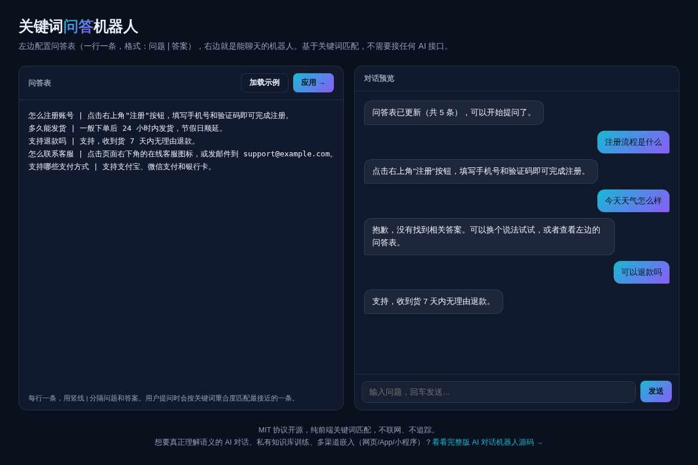

# 关键词问答机器人 · FAQ Bot

**[在线体验 →](https://anna123123123-creator.github.io/faq-bot/)**

免费开源、纯浏览器运行的关键词匹配问答机器人。配置一份"问题 | 答案"表，就能得到一个能聊天的 FAQ 机器人——不用接任何 AI 接口、不用后端、不联网。



## 试用方法

直接用浏览器打开 `index.html`，或用静态文件服务器跑起来：

```bash
python3 -m http.server 8000
```

## 问答表格式

```
怎么注册账号 | 点击右上角"注册"按钮，填写手机号和验证码即可完成注册。
多久能发货 | 一般下单后 24 小时内发货。
```

每行一条，用竖线 `|` 分隔问题和答案。

## 匹配原理

用户提问时，工具会把问题拆成字符集合，和问答表里每条"问题"的字符集合算重合度（交集 / 较短集合的大小），取分数最高且超过阈值的一条作为答案；都不够相似就返回兜底话术。整个过程是纯规则匹配，不涉及任何模型或网络请求，`script.js` 里大概 100 行原生 JavaScript。

## 协议

MIT。

## 相关项目

这个是做 **AI 对话机器人**产品时顺手做的免费小工具——只做最基础的关键词匹配，理解不了语义、也记不住上下文。完整版是真正理解语义的多轮对话、私有知识库训练、多渠道嵌入（网页/App/小程序），源码在这：[AI 对话机器人网站源码](https://inzyxuashop.com/aiduihua-yuanma.html)。
